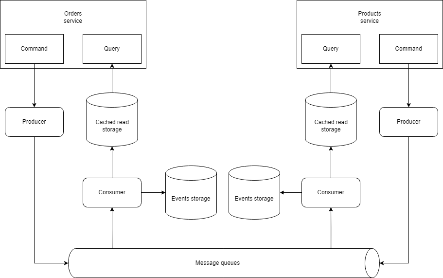

## About

A simple microservices system for managing orders and products built on the event sourcing and CQRS ideologies.

High-level diagram explaining how everything is connected:



## Built with

* Nginx
* go-swagger
* RabbitMQ
* Amazon DynamoDB

## Prerequisites 

* Docker


## Usage 

Run in root directory:
```sh
make run
```
